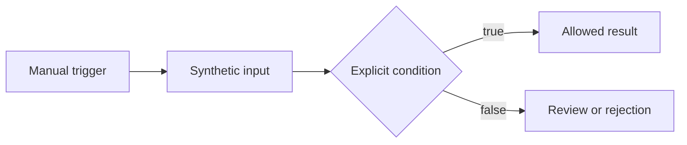

# n8n Automation Patterns

Small n8n workflow JSON examples that illustrate explicit validation, bounded retry decisions, health-signal routing, and tenant-scoped retrieval. All four examples start manually, are inactive, and work offline with synthetic inputs. No Agent node, authored prompt, credential, or external integration is included.

| Example | Decision | Safe outcome |
| --- | --- | --- |
| [Event envelope](examples/validate-event-envelope.json) | Check an event identifier and type | Accept or reject explicitly |
| [Retry gate](examples/gate-retry-attempt.json) | Compare an attempt with a sample limit | Mark eligible or request review |
| [Health signal](examples/route-health-signal.json) | Classify a sample status code | Mark normal or request review |
| [Tenant-scoped retrieval](examples/retrieve-tenant-sample.json) | Filter synthetic documents by tenant and publication state before keyword scoring | Return only bounded matches in the selected sample scope |

## Design

In the three decision examples, each branch terminates in a named result. In the retry example, `attempt` is the proposed attempt number; the workflow only decides whether it is within the sample limit and does not repeat an operation. The health example classifies a supplied sample: it does not monitor a service or send an alert. The retrieval example first filters an in-memory synthetic fixture by `tenant_id` and `published`, then scores keyword matches and returns at most three. It demonstrates the order of operations and fail-closed handling of an unknown sample scope. It is not vector search, a production authorization layer, or proof of isolation in a database. None of these offline examples calls a network service.

## Run locally

1. Use Python 3.12 or newer and Node.js 24 for local tests. No Python or Node packages, environment variables, API keys, or account are required for the checks.
2. From the repository root, run `python scripts/validate_examples.py`, `python scripts/build_retrieval_example.py --check`, `python -m unittest discover -s tests -v`, and `node --test tests/tenant_retrieval.test.mjs`. The generated retrieval JSON embeds the code in `src/tenant_retrieval.js`; the check rejects a stale copy.
3. In a disposable n8n instance, import one JSON file from `examples/` and run it manually. Change only synthetic fields in the **Create sample** or **Create sample query** node to inspect the results. Keep the workflow inactive.

The JSON graph, connections, inactive state, and absence of embedded credentials and arbitrary network nodes are checked automatically. Import and execution in a particular n8n version have **not** been verified here; node compatibility and runtime behavior remain to be tested in an isolated instance.

## Security boundaries

- The workflows contain no credentials, external addresses, webhooks, customer records, or operational tenant identifiers.
- No example is configured to activate automatically or mutate an external system.
- The retrieval example uses only an in-memory synthetic fixture. No example includes an AI or model-provider call.
- Static checks reject unexpected node types, export metadata such as pinned execution data, missing branches, authored prompt fields, credential fields, common inline secret markers, and external-address fields. These checks supplement manual review and secret scanning.
- Do not replace synthetic fields with operational data or connect these workflows to a production instance without a separate review.

See [SECURITY.md](SECURITY.md) for responsible reporting. The repository intentionally contains no deployment configuration or license. Infrastructure integrations are outside the verified scope of these examples.

## Resumo em português

Quatro workflows sintéticos e inativos demonstram validação de entrada, decisão de tentativa limitada, classificação de um sinal de saúde e busca por palavras com filtro de tenant e estado de publicação. Os testes conferem a estrutura, a lógica da busca sintética e os limites de segurança dos arquivos. A busca não representa autorização de produção nem busca vetorial. A execução em uma versão específica do n8n ainda precisa de validação em ambiente isolado. Nenhum export contém Agent, prompt, credencial ou chamada externa.
